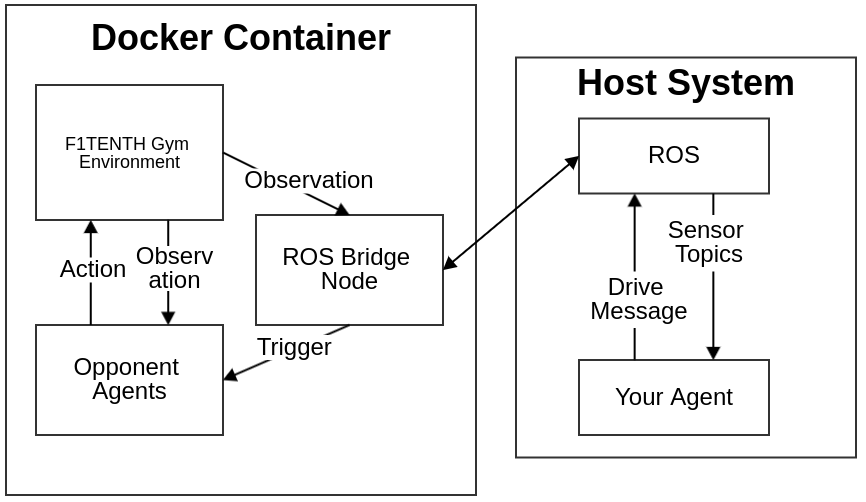

# F1TENTH Simulator (C++ Core)

A unified repository for the F1TENTH racing simulator. All simulation — vehicle dynamics (single-track model), 2D LiDAR ray casting, and collision checking — runs in a single C++ core, exposed both as an OpenAI Gym environment for reinforcement learning and as a ROS 2 stack for autonomy development.



```
                 ┌───────────────────────────────┐
                 │  C++ simulation core          │
                 │  gym/f110_gym/cpp_backend.cpp │
                 │  dynamics · LiDAR · collision │
                 └──────────────┬────────────────┘
                                │ Python C extension (f110_gym._cpp_backend)
                 ┌──────────────┴────────────────┐
                 │  f110_gym (OpenAI Gym API)    │
                 │  f110-v0 · f110-rl-v0         │
                 └───────┬───────────────┬───────┘
                         │               │
              ┌──────────┴─────┐  ┌──────┴──────────────────┐
              │  RL / examples │  │  f1tenth_gym_ros        │
              │  (no ROS)      │  │  ROS 2 bridge + RViz    │
              └────────────────┘  └─────────────────────────┘
```

## Repository layout

```
.
├── install.sh              # one-command build (gym + C++ core + ROS 2 bridge)
├── setup.py                # f110_gym package, compiles the C++ extension
├── gym/f110_gym/
│   ├── cpp_backend.cpp     # C++ simulation core (dynamics, LiDAR, collision)
│   └── envs/               # Gym environments (f110-v0, f110-rl-v0), rendering, maps
├── examples/               # ROS-free examples (waypoint following, RL rollout)
└── f1tenth_gym_ros/        # ROS 2 package: gym_bridge node, launch, RViz, maps
    ├── config/sim.yaml     # simulation configuration (map, agents, vehicle params)
    └── maps/               # bundled maps (levine, Spielberg_map)
```

## Requirements

- Ubuntu 22.04, Python ≥ 3.9 (3.10 recommended)
- A C++17 compiler (`sudo apt install build-essential`)
- **Optional, for the ROS 2 simulator:** ROS 2 Humble. `./install.sh` installs the bridge's ROS dependencies automatically via `rosdep`; to install them manually instead:
  ```bash
  pip3 install transforms3d
  sudo apt install ros-humble-rviz2 ros-humble-nav2-map-server ros-humble-nav2-lifecycle-manager \
                   ros-humble-ackermann-msgs ros-humble-xacro ros-humble-robot-state-publisher \
                   ros-humble-joint-state-publisher
  ```

## Installation

One command builds everything:

```bash
git clone https://github.com/PARKasd/f1sim_C.git
cd f1sim_C
./install.sh
```

`install.sh` does two things:

1. `pip3 install -e .` — installs the `f110_gym` package and compiles the C++ simulation core.
2. If ROS 2 is installed, installs the bridge's ROS dependencies (`rosdep`) and runs `colcon build` for the `f1tenth_gym_ros` bridge (skipped otherwise, so the repo works fine as a pure Gym environment on machines without ROS).

## Running

### ROS 2 simulator

```bash
source install/setup.bash
ros2 launch f1tenth_gym_ros gym_bridge_launch.py
```

This starts the simulation, RViz, and a map server. The default map is `levine`, bundled with the package.

| Topic | Type | Direction | Description |
|---|---|---|---|
| `/drive` | `ackermann_msgs/AckermannDriveStamped` | sub | ego steering angle + speed command |
| `/scan` | `sensor_msgs/LaserScan` | pub | ego 2D LiDAR (1080 beams, 4.7 rad FOV) |
| `/ego_racecar/odom` | `nav_msgs/Odometry` | pub | ego pose and velocity |
| `/initialpose` | `PoseWithCovarianceStamped` | sub | reset ego pose (RViz **2D Pose Estimate**) |
| `/cmd_vel` | `geometry_msgs/Twist` | sub | keyboard teleop (when `kb_teleop: True`) |

With `num_agent: 2`, the opponent adds `/opp_drive`, `/opp_scan`, `/opp_racecar/odom`, and pose reset via `/goal_pose` (RViz **2D Goal Pose**).

Keyboard teleop:

```bash
ros2 run teleop_twist_keyboard teleop_twist_keyboard
```

### Gym API (no ROS required)

```bash
cd examples
python3 waypoint_follow.py       # pure-pursuit lap with the built-in renderer
python3 rl_random_rollout.py     # single-agent RL environment (f110-rl-v0)
```

Or directly:

```python
import gym, numpy as np, f110_gym

env = gym.make('f110_gym:f110-v0', map='levine', map_ext='.pgm', num_agents=1)
obs, _, done, _ = env.reset(np.array([[0.0, 0.0, 0.0]]))
obs, reward, done, info = env.step(np.array([[0.0, 2.0]]))  # [steer, speed]
```

### Docker (with browser-based GUI)

```bash
docker compose up -d
docker exec -it f1tenth_gym-sim-1 /bin/bash
# inside the container:
source install/setup.bash && ros2 launch f1tenth_gym_ros gym_bridge_launch.py
```

Then open [http://localhost:8080/vnc.html](http://localhost:8080/vnc.html) to see RViz.

## Configuration

Everything is configured in **`f1tenth_gym_ros/config/sim.yaml`** (rebuild not required thanks to `--symlink-install`; just relaunch):

- `map_path` — a bare name (`levine`, `Spielberg_map`) is resolved against the bundled `f1tenth_gym_ros/maps/`; use an absolute path without extension for a custom map (image + ROS map yaml side by side, `map_img_ext` set to match).
- `num_agent` — 1 or 2 agents.
- `timestep`, `integrator` — physics step (default 0.01 s) and integrator (`RK4` or `Euler`).
- `vehicle.*` — full single-track dynamics parameters (mass, cornering stiffness, steering/velocity limits, ...). See **`f1tenth_gym_ros/config/vehicle_parameters.md`** for the meaning, units, and effect of each parameter.

For the pure Gym API, the same vehicle parameters can be passed as kwargs (`params=...`) or loaded from a YAML file (`params_file=...`, see `examples/vehicle_params.yaml`).

## Citing

This simulator is based on the F1TENTH Gym environment. If you find it useful, please consider citing:

```bibtex
@inproceedings{okelly2020f1tenth,
  title={F1TENTH: An Open-source Evaluation Environment for Continuous Control and Reinforcement Learning},
  author={O'Kelly, Matthew and Zheng, Hongrui and Karthik, Dhruv and Mangharam, Rahul},
  booktitle={NeurIPS 2019 Competition and Demonstration Track},
  pages={77--89},
  year={2020},
  organization={PMLR}
}
```

## Acknowledgements

Derived from [f1tenth/f1tenth_gym](https://github.com/f1tenth/f1tenth_gym) and [f1tenth/f1tenth_gym_ros](https://github.com/f1tenth/f1tenth_gym_ros), with the Python physics/scan/collision backend replaced by a C++ core. MIT License.
